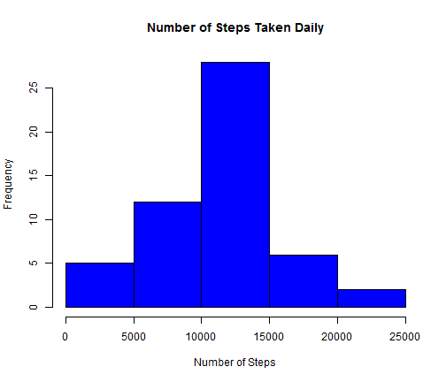
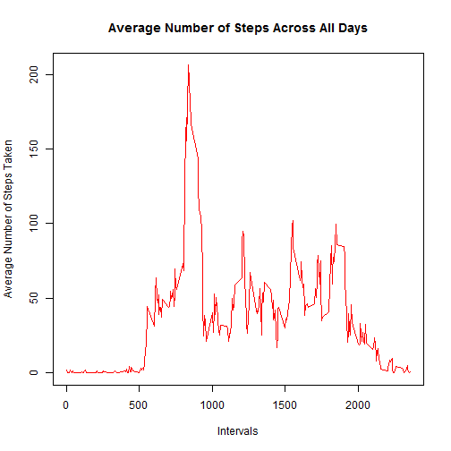
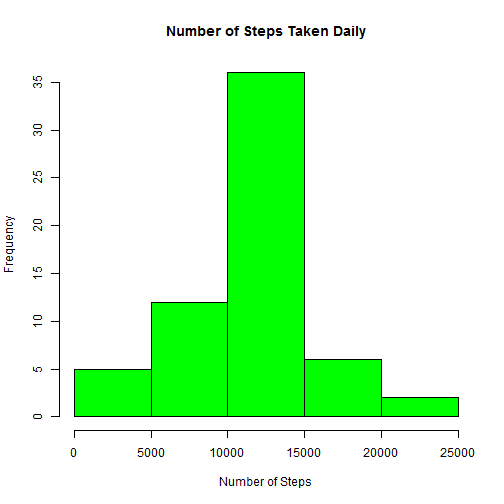
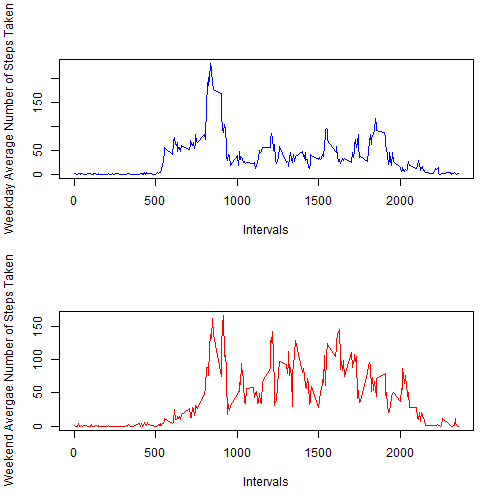

Reproducible Research: Peer Assessment 1
========================================================

## Loading and Preprocessing the Data

To begin this assignment, the data was first loaded:


```r
setwd("~/Data Science/Reproducible Research/Week 1")
Data <- read.csv("activity.csv")
```


## What is the mean total number steps taken per day?

Below you can see that the mean total number steps taken per day is 10766.19 and the median total number steps taken per day is 10765. There is also a historgram displayed which shows how the total number of steps taken per day is distributed.


```r
library(plyr)
library(reshape2)
library(knitr)
Data2 <- ddply(Data, c("date"), summarise, sum = sum(steps))
hist(Data2[, 2], xlab = "Number of Steps", main = "Number of Steps Taken Daily", 
    col = "blue")
```

 

```r
options(digits = 2)
sprintf("%.2f", mean(Data2[, 2], na.rm = TRUE))
```

```
## [1] "10766.19"
```

```r
sprintf("%.2f", median(Data2[, 2], na.rm = TRUE))
```

```
## [1] "10765.00"
```


## What is the average daily activity pattern?

The plot below is a time series plot of the 5-Minute Intervals on the x-axis and the number of steps taken on the y axis, averaged accross all days. You can also see that interval 835 contains on average across all days in the dataset, the maximum number of steps.


```r
Data3 <- ddply(Data, c("interval"), summarize, mean = mean(steps, na.rm = TRUE))
plot(Data3[, 1], Data3[, 2], type = "l", xlab = "Intervals", ylab = "Average Number of Steps Taken", 
    main = "Average Number of Steps Across All Days", col = "red")
```

 

```r
Data3[which.max(Data3[, 2]), 1]
```

```
## [1] 835
```


## Imputing Missing Values

The total number of missing values in the dataset is 2304, which can be seen below. My strategy for filling in all the missing values in the dataset is to replace the NA entries with the mean associated with its 5 minute interval. The new dataset with this strategy is created below. The histogram of the total number of steps taken each day was then computed using the new dataset with the missing values imputed, as well as the mean and median total number number of steps per day which are both equal to 10766.19. The mean is the same value as the mean from the first part of the assignment but the median is different, instead of 10765, it's equal to 10766.19. Therefore, using the mean for that 5 minute interval to impute the missing data caused the mean to remain the same and the median to increase slightly to be equal to the mean.


```r
sum(is.na(Data[, 1]))
```

```
## [1] 2304
```

```r
for (i in 1:nrow(Data)) {
    if (is.na(Data[i, 1]) == TRUE) {
        Data[i, 1] = Data3[which(Data3$interval == Data[i, 3]), 2]
    }
}
Data2 <- ddply(Data, c("date"), summarise, sum = sum(steps))
hist(Data2[, 2], xlab = "Number of Steps", main = "Number of Steps Taken Daily", 
    col = "green")
```

 

```r
sprintf("%.2f", mean(Data2[, 2], na.rm = TRUE))
```

```
## [1] "10766.19"
```

```r
sprintf("%.2f", median(Data2[, 2], na.rm = TRUE))
```

```
## [1] "10766.19"
```


## Are there differences in activity patterns between weekdays and weekends?

In order to answer this question, I added a new factor varaible in the dataset - "weekday" and "weekend" indicating whether a given data is a weekday or a weekend day. I then created a panel plot containing a time series plot of the 5-minute interval on the x-axis and the average number of steps taken, averaged across all weekday days (Top Plot) and weekend days (Bottom Plot) on the y axis. As you can see from the plot below, the most notable difference between the weekend data and the weekday data is that the range is larger on the weekday plot.


```r
par(mfrow = c(2, 1))
day <- as.Date(Data[, 2])
day <- weekdays(day)
for (i in 1:nrow(Data)) {
    if (day[i] == "Saturday" || day[i] == "Sunday") {
        Data[i, 4] = "weekend"
    } else {
        Data[i, 4] = "weekday"
    }
}
week_data <- ddply(Data, c("interval", "V4"), summarize, mean = mean(steps))
weekday_data <- week_data[week_data[, 2] == "weekday", ]
weekend_data <- week_data[week_data[, 2] == "weekend", ]
plot(weekday_data[, 1], weekday_data[, 3], type = "l", col = "blue", xlab = "Intervals", 
    ylab = "Weekday Average Number of Steps Taken")
plot(weekend_data[, 1], weekend_data[, 3], type = "l", col = "red", xlab = "Intervals", 
    ylab = "Weekend Avergae Number of Steps Taken")
```

 

